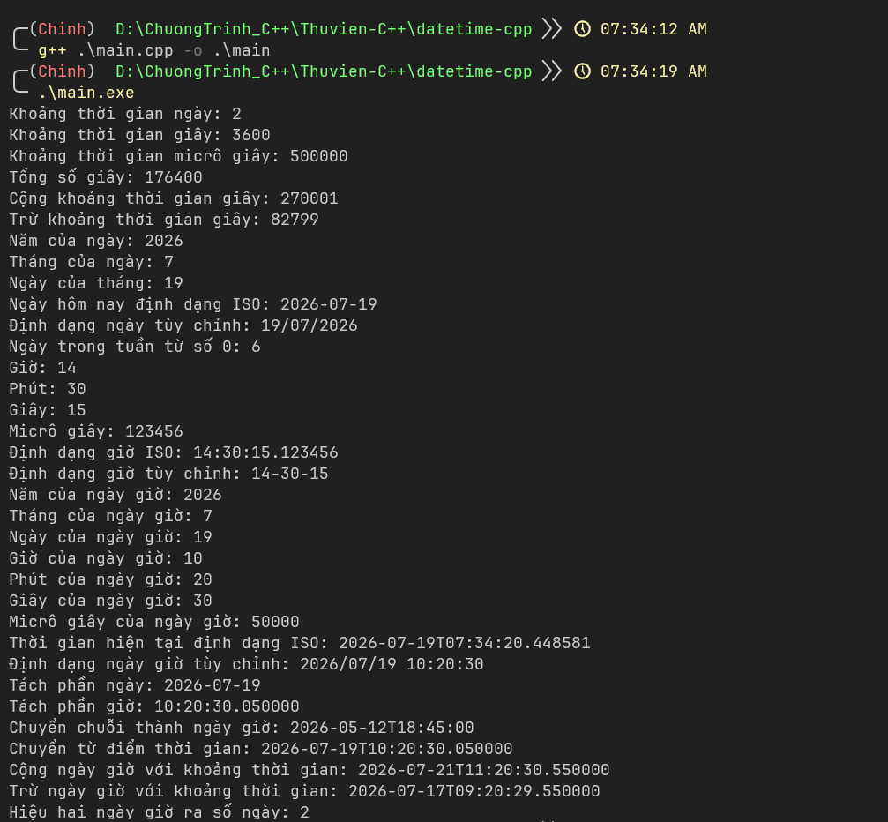

# datetime-cpp

## Giới thiệu
- Datetime C++ là thư viện tự build dựa trên thư viện ctime và chrono có sẵn của trình biên dịch mingw64 c++
- Với cú pháp ngắn gọn y như datetime python giúp lấy thời gian 1 cách nhanh chóng và linh hoạt

> Ví dụ:
```cpp
#include <iostream>
#include <datetime.hpp>

using namespace std;
using namespace dt;

int main(){
    cout << datetime::now().strftime("%H:%M:%S - %d/%m/%Y") << endl;
    return 0;
}
``` 

> Kèm lệnh dịch
```bash
g++ main.cpp -o main.exe
```

> Chạy
```bash
main.exe
```

### Kết quả của file main.cpp


## Cách dùng 
- Đưa file datetime.hpp vào đường dẫn sau để dùng như 1 thư viện mặc định 
```bash
msys64\mingw64\include\c++\14.1.0\datetime.hpp
```