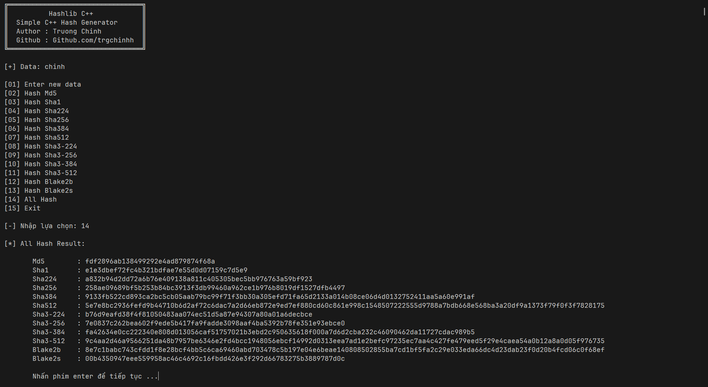

# hashlib-cpp

## Giới thiệu
- Hashlib C++ là thư viện tự build dựa trên thư viện openssl của trình biên dịch mingw64 c++
- Với cú pháp ngắn gọn y như hashlib python giúp hash 1 cách nhanh chóng

> Ví dụ:
```cpp
#include <iostream>
#include <hashlib.h>

using namespace std;
using namespace hashlib;

int main(){
    cout << "[?] Enter your data: ";
    string data; cin >> data;
    string hash_data = sha256(data).hexdigest();
    cout << "[-] Your hash: " << hash_data << endl;
    return 0;
}
```

> Kèm lệnh dịch
```bash
g++ main.cpp -o main.exe -lssl -lcrypto
```
> Chạy
```bash
main.exe
```

### Kết quả của file main.cpp


## Cách dùng 
- Đưa file hashlib.hpp vào đường dẫn sau để dùng như 1 thư viện mặc định
```bash
msys64\mingw64\include\c++\14.1.0\hashlib.hpp
```
