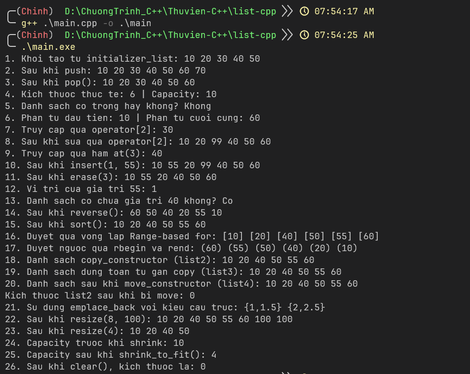

# list-cpp

## Giới thiệu
- List C++ là thư viện tự build không dựa trên bất kỳ thư viện nào khác như vector hay array thường. Đây là thư viện tự xây dựng từ số 0 bằng cách tự quản lý và cấp phát bộ nhớ động
- Với cú pháp ngắn gọn như list python giúp người dùng sử dụng 1 cách linh hoạt 

> Ví dụ:
```cpp
#include <iostream>
#include <list.hpp>

using namespace std;

int main(){
    // tạo 1 list kiểu số nguyên

    // Tạo ô trống (chứa 0)
    List<int> list(5);

    // Có sẵn giá trị
    List<int> list1 = {1, 2, 3, 4, 5};

    // Không có giá trị nào 
    List<int> list2;

    // Khi in có thể duyệt thông thường hoặc in trực tiếp list
    cout << list1 << endl;
    // Kết quả sẽ là 1 2 3 4 5

    return 0;
}
```

> Kèm lệnh dịch
```bash
g++ main.cpp -o main.exe
```

> Chạy
```bash
main.exe
```

### Kết quả của file main.cpp


## Cách dùng
- Đưa file list.hpp vào đường dẫn sau để dùng như 1 thư viện mặc định
```bash
msys64\mingw64\include\c++\14.1.0\list.hpp
```