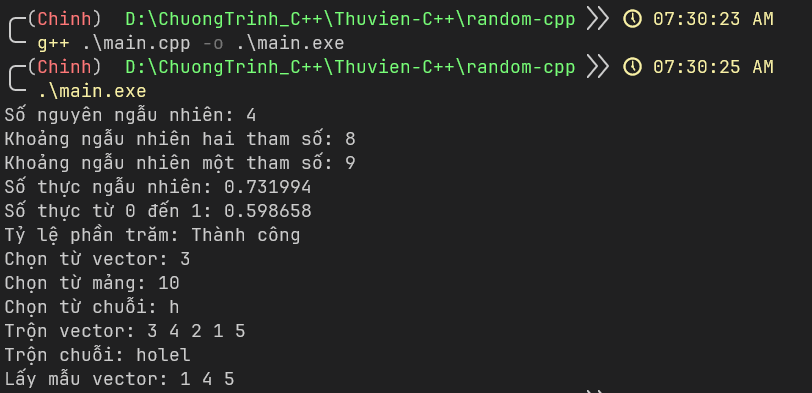

# random-cpp

## Giới thiệu
- Random C++ là thư viện tự build dựa trên thư viện random có sẳn của trình biên dịch mingw64 c++
- Với cú pháp ngắn gọn như random python giúp random 1 cách nhanh chóng và có thể tùy biến cú pháp linh hoạt theo yêu cầu

> Ví dụ
```cpp
#include <iostream>
#include <random.hpp>

using namespace std;
using namespace random;

int main(){
    cout << "Random number" << randint(1, 100) << endl;
    return 0;
}
```

> Kèm lệnh dịch
```bash
g++ main.cpp -o main.exe 
```

> Chạy
```bash
main.exe
```

### Kết quả của file main.cpp


## Cách dùng 
- Đưa file random.hpp vào đường dẫn sau để dùng như 1 thư viện mặc định
```bash
msys64\mingw64\include\c++\14.1.0\random.hpp
```